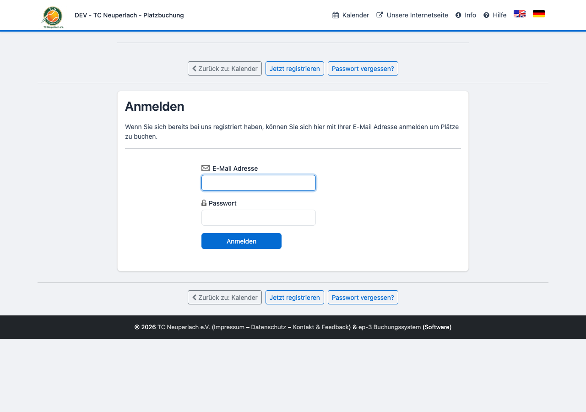
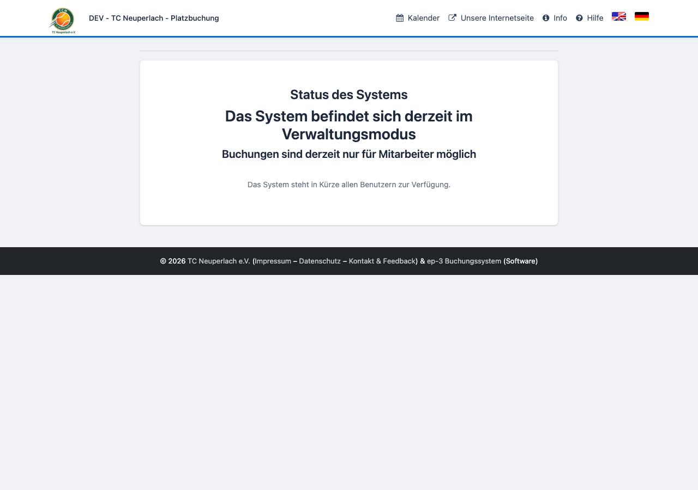
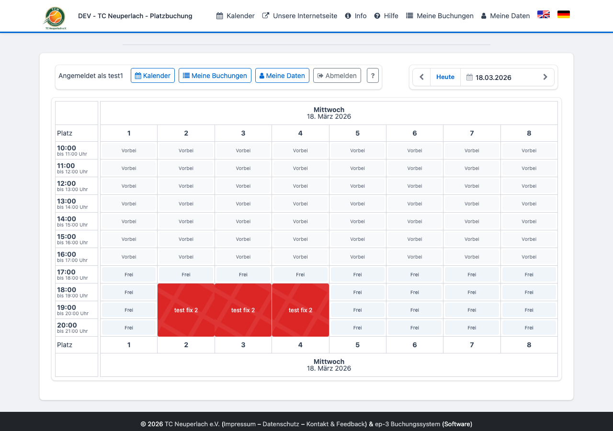
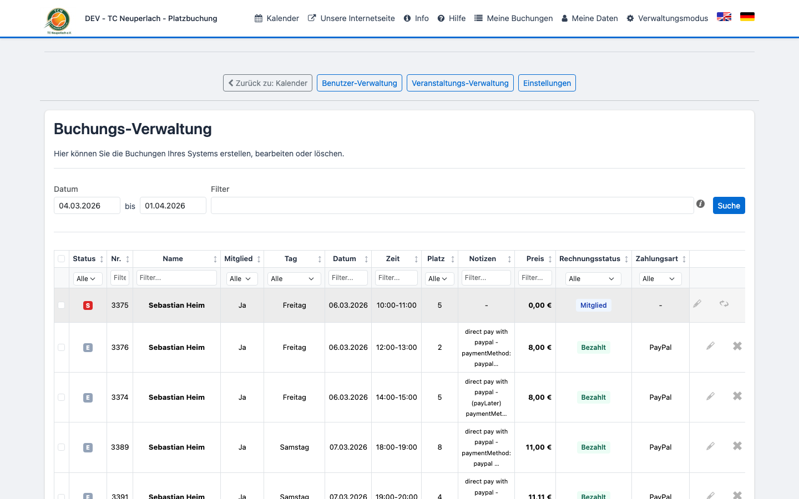
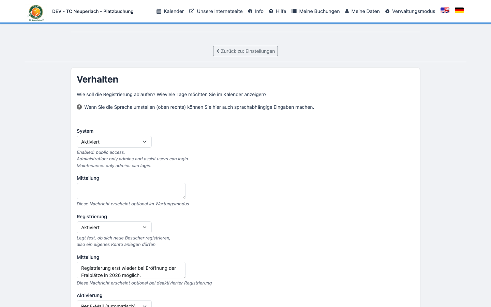

# Mitarbeiter-Handbuch – Tennisplatzbuchung TCN Kail

**System:** [platzbuchung.tcn-kail.de](https://platzbuchung.tcn-kail.de)

---

## 1. Anmelden

Login-Seite: [platzbuchung.tcn-kail.de/user/login](https://platzbuchung.tcn-kail.de/user/login)

> **Wichtig:** Im Verwaltungsmodus gibt es keinen sichtbaren Login-Link auf der Sperrseite.
> Die Login-URL direkt im Browser eingeben: `platzbuchung.tcn-kail.de/user/login`

---

## 2. Verwaltungsmodus

Wenn das System im **Verwaltungsmodus** ist, sehen normale Mitglieder und Gäste diese Seite:

Mitarbeiter und Admins können sich trotzdem anmelden und Buchungen vornehmen.

---

## 3. Kalender & Buchungen anlegen

Nach dem Login siehst du den Kalender. Freie Slots können direkt angeklickt und gebucht werden — auch für andere Mitglieder.

**Buchung für ein Mitglied anlegen:**

1. Freien Slot anklicken
2. Namen des Mitglieds eintragen
3. **Jetzt buchen** bestätigen
4. Das Mitglied erhält automatisch eine Bestätigungs-E-Mail

---

## 4. Backend – Buchungs-Verwaltung

Aufruf: [platzbuchung.tcn-kail.de/backend/booking](https://platzbuchung.tcn-kail.de/backend/booking)

| Symbol | Aktion |
|--------|--------|
| ✏️ (Stift) | Buchung bearbeiten |
| ✕ (Kreuz) | Buchung stornieren |
| ↺ (Pfeil) | Buchung reaktivieren *(nur wenn Slot frei + Berechtigung vorhanden)* |

**Stornieren:**
1. Buchung in der Liste suchen → **✕** klicken
2. Bestätigungsseite: Stornierung bestätigen
3. Guthaben wird automatisch zurückgebucht

**Reaktivieren:**
Erscheint nur bei stornierten Buchungen, wenn der Slot noch frei ist und die Berechtigung `calendar.reactivate-bookings` vorhanden ist.

---

## 5. Backend – Systemstatus konfigurieren

Aufruf: [platzbuchung.tcn-kail.de/backend/config/behaviour](https://platzbuchung.tcn-kail.de/backend/config/behaviour)

**System-Dropdown:**

| Einstellung | Wer kann sich anmelden |
|-------------|------------------------|
| **Aktiviert** | Alle Benutzer |
| **Verwaltungsmodus** | Admins + Mitarbeiter |
| **Wartungsarbeiten** | Nur Admins |

---

## Häufige Fragen

**Ich kann mich nicht anmelden.**
Prüfe ob das System im Wartungsmodus ist. Im Wartungsmodus können sich nur Admins einloggen — Admin kontaktieren.

**Das Reaktivieren-Symbol fehlt.**
Entweder ist der Slot bereits belegt, oder die Berechtigung `calendar.reactivate-bookings` fehlt. Admin fragen.

**Kein Zahlungsbutton sichtbar.**
Zahlungsoptionen erscheinen nur bei einem Gesamtbetrag > 0 € und gültiger Preisregel für das Datum.
