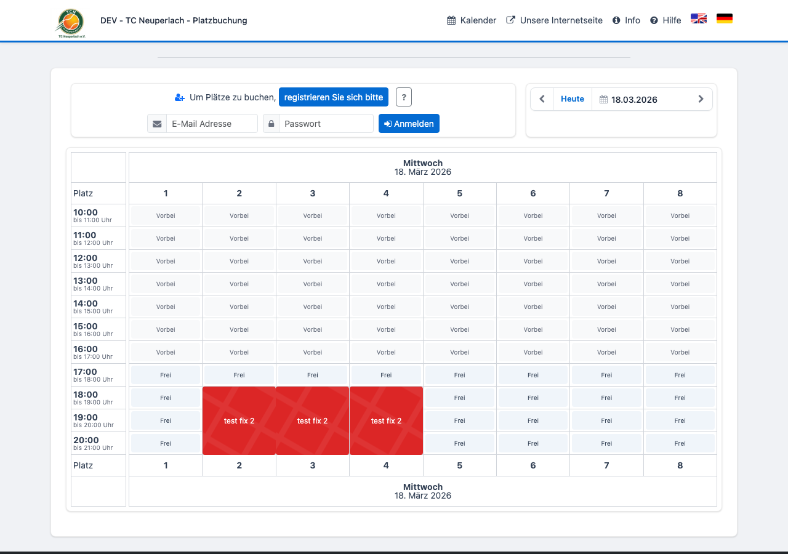
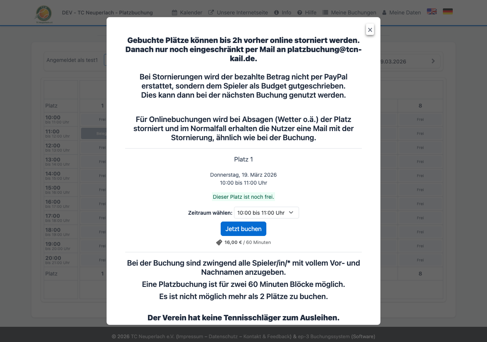
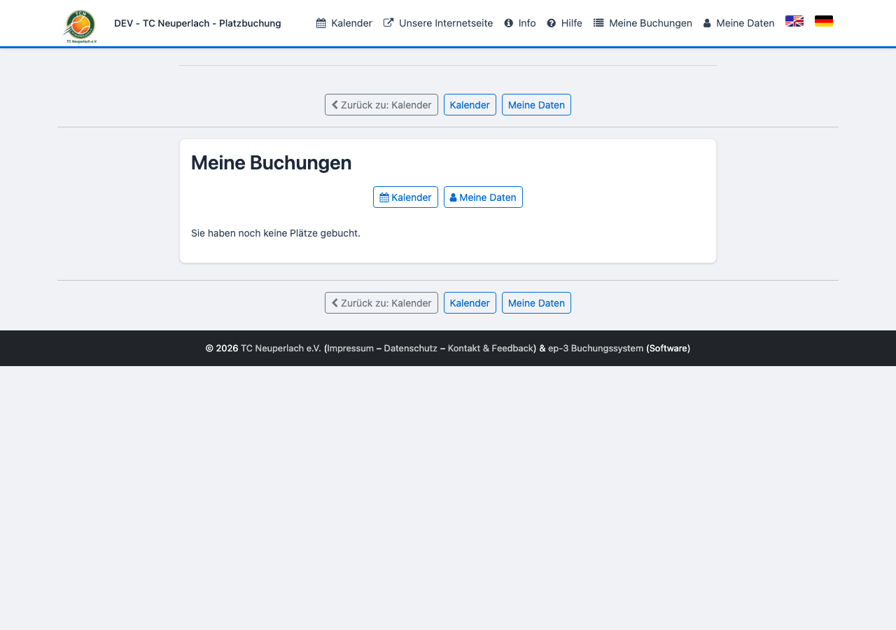
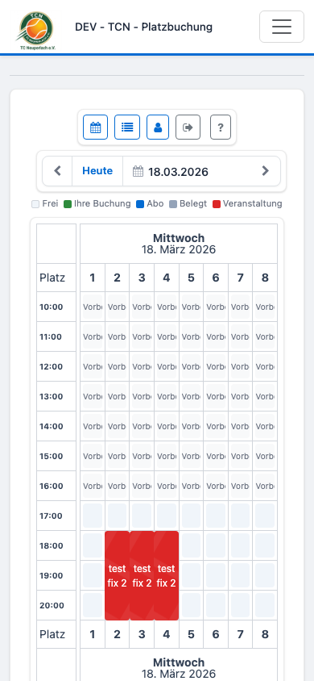

# Benutzerhandbuch – Tennisplatzbuchung TCN Kail

**System:** [platzbuchung.tcn-kail.de](https://platzbuchung.tcn-kail.de)

---

## 1. Startseite & Kalender

Auf der Startseite siehst du den Buchungskalender mit allen Plätzen und Zeitslots.
Um einen Platz zu buchen, musst du angemeldet sein.

---

## 2. Anmelden

Öffne [platzbuchung.tcn-kail.de/user/login](https://platzbuchung.tcn-kail.de/user/login) oder klicke auf **Anmelden** im Kalender.

---

## 3. Kalender nach dem Login

Nach dem Login siehst du alle freien und belegten Slots. Freie Slots sind hell und klickbar.

### Farblegende

| Farbe | Bedeutung |
|-------|-----------|
| Weiß (leer) | Frei – buchbar |
| Grau | Belegt |
| Rot / dunkel | Veranstaltung |
| Blau-grün | Deine eigene Buchung |

---

## 4. Platz buchen

Klicke auf einen freien Slot. Es öffnet sich das Buchungsfenster mit Details zu Platz und Zeit. Lies die Regeln und klicke auf **Jetzt buchen**.

---

## 5. Meine Buchungen

Unter **Meine Buchungen** (oben in der Navigation) siehst du alle deine Reservierungen.

- Ausstehende Zahlungen sind **gelb** hervorgehoben
- Klick auf den Betrag öffnet die Zahlungsseite

---

## 6. Buchung stornieren

1. **Meine Buchungen** aufrufen
2. Gewünschte Buchung auswählen
3. **Stornieren** klicken und bestätigen

> Gebuchte Plätze können bis **2h vorher** storniert werden.
> Ein bereits bezahltes Guthaben wird automatisch zurückgebucht.

---

## 7. Mobil

Das System ist vollständig mobil nutzbar. Der Kalender passt sich automatisch an kleine Bildschirme an.

---

## Häufige Fragen

**Ich sehe keine freien Slots.**
Der Kalender zeigt nur buchbare Tage. Versuche einen anderen Tag über den Pfeil oben rechts.

**Die Zahlung erscheint nicht.**
Kostenlose Buchungen (z. B. Mitglieder) werden direkt bestätigt – keine Zahlung nötig.

**Keine Bestätigungs-E-Mail erhalten.**
Bitte Spam-Ordner prüfen. Bei weiteren Problemen den Verein kontaktieren:
[platzbuchung.tcn-kail.de](https://platzbuchung.tcn-kail.de)
